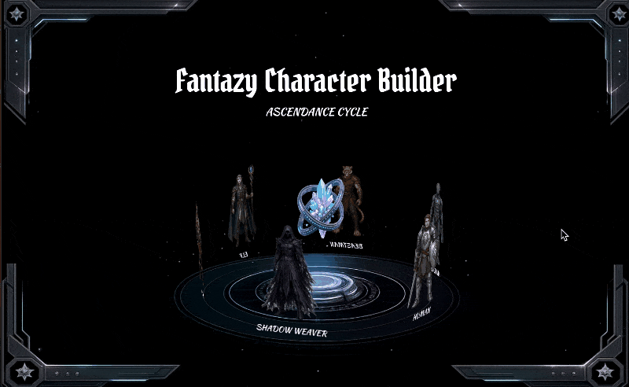
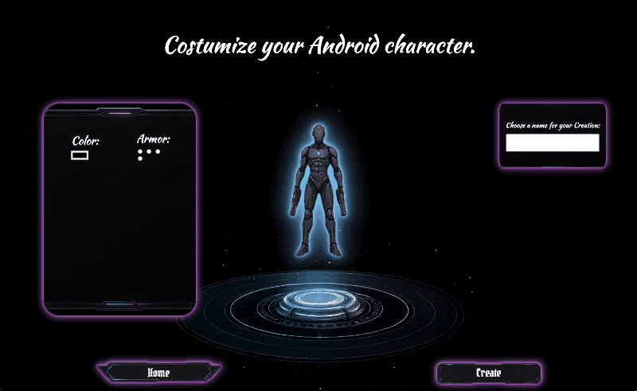
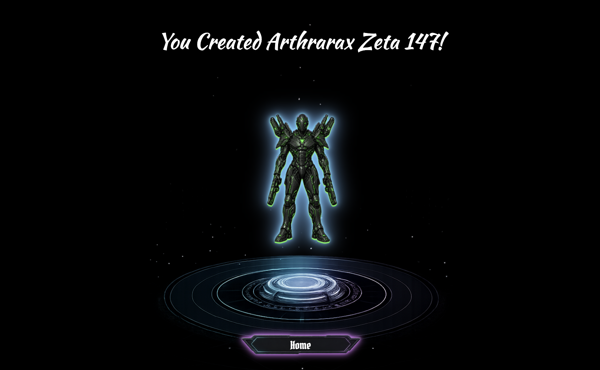

# Fantasy Character Builder

A fantasy character creator built with Vanilla JavaScript.

> Personal project created to practice DOM manipulation, state management, modular JavaScript architecture, and responsive UI development.


## Project Status

Current version: MVP

The project is functional and demonstrates the complete character creation flow. Future updates may include additional customization options, mobile support, SVG assets, and a layer-based character system.


## Live Demo

### GitHub Pages URL:

[Click here](https://joaovitorscordeirocontact-cpu.github.io/Fantasy-character-builder/)


## Preview

### Home Page



### Character Builder



### Character Presentation




## Features

### Character Selection

* Browse available fantasy races through a custom 3D slider
* Select a character to customize

### Character Customization

* Dynamic customization options based on the selected race
* Multiple armor variations
* Hue-based color customization
* Real-time visual updates

### Character Presentation

* Dedicated presentation page
* Character name display
* Character preview rendering

### User Experience

* Fantasy-themed user interface
* Animated page transitions
* Glow visual effects
* Desktop responsive layout


## Technologies

* HTML5
* CSS3
* Vanilla JavaScript (ES Modules)
* Local Storage


## Concepts Practiced

This project was built to strengthen my understanding of:

* DOM Manipulation
* Event Handling
* State Management
* Dynamic Rendering
* Modular JavaScript Architecture
* Local Storage
* CSS Animations
* Responsive Design
* Asset Organization
* Component-Based Thinking


## Project Structure

```text
assets/
├── images/
└── icons/

styles/
├── index.css
├── character-builder.css
├── presentation.css
└── texts.css

scripts/
├── index.js
├── character-builder.js
├── presentation.js
├── armor.js
└── data/

README.md
```


## Current Limitations

* Designed primarily for desktop screens
* Mobile layout not yet implemented
* Character parts are generated as complete images rather than independent layers
* Character customization options are currently limited
* Character data is stored locally


## Future Improvements

### Character Customization

* Layer-based character system
* Separate armor, hair, body, and accessory layers
* Additional armor variations
* Hair customization
* Facial customization
* Weapon customization
* Expanded color customization system

### Technical Improvements

* SVG-based assets for advanced customization
* Improved mobile responsiveness
* Dedicated tablet and mobile layouts
* Better animation system
* Performance optimizations
* Refactoring and code organization improvements

### Gameplay Features

* Character save slots
* Character export system
* Character statistics
* Expanded fantasy races
* Progression system


## What I Learned

During the development of this project, I practiced building a complete front-end application without frameworks.

Some of the main concepts I improved were:

* Structuring JavaScript applications into modules
* Managing application state across pages
* Dynamically rendering content
* Organizing reusable functions
* Creating responsive layouts
* Working with animations and visual effects
* Building a complete user flow from selection to presentation


## Author

### João Vítor Cordeiro

[GitHub Profile](https://github.com/joaovitorscordeirocontact-cpu)